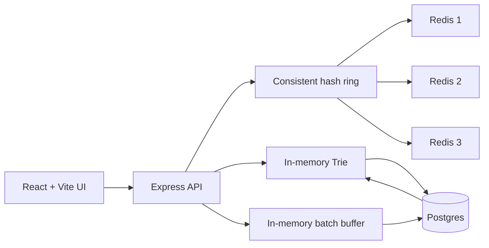

# Search Typeahead System

A full-stack search typeahead application built around durable query counts, an in-memory prefix index, distributed Redis caching, recency-aware ranking, and batched writes.

## Architecture



- **Postgres** is the durable source of truth. It replaces the roadmap's SQLite suggestion to provide stronger concurrent-write handling while preserving the same storage role.
- **Trie** is rebuilt from Postgres at startup and indexes normalized queries by prefix. Each node stores child links and an optional terminal query record; cache misses traverse the prefix subtree and a fixed-size heap selects the top 10 dynamically.
- **Redis** is a cache, never a source of truth. Three logical nodes are used to distribute throughput and demonstrate consistent hashing.
- **Batch writer** swaps the active in-memory buffer every 30 seconds or 100 events, aggregates duplicate queries, and writes once per distinct query.

## Requirements

- Node.js 20 or newer
- Docker Desktop with Docker Compose
- AOL Search Query Logs dataset files

No API keys are required.

## Setup

1. Create local configuration:

   ```bash
   cp .env.example .env
   ```

2. Install dependencies:

   ```bash
   npm install
   ```

3. Start Postgres and the three Redis nodes:

   ```bash
   npm run infra:up
   docker compose ps
   ```

4. Place the AOL files in `data/raw/`. The loader accepts a `.txt`, `.tsv`, or `.csv` file, or a directory containing those files.

5. Aggregate and load the dataset:

   ```bash
   npm run ingest -- --input data/raw
   ```

   Ingestion replaces the current `queries` table contents. It normalizes and aggregates queries, refuses inputs with fewer than 100,000 distinct valid rows, and prints the final Postgres row count.

6. Start the API and UI:

   ```bash
   npm run dev
   ```

   - UI: `http://localhost:5173`
   - API: `http://localhost:3000`

The API returns `503` from suggestion endpoints until a non-empty dataset has been loaded and the Trie has been built. Restart the API after ingestion if it was already running.

## Dataset Handling

The source is the **AOL Search Query Logs dataset (2006)**. Raw rows commonly contain an anonymized user ID, query, timestamp, rank, and click URL. The loader extracts only query text and immediately aggregates it into:

```text
normalized_query | count
```

User IDs, timestamps, click URLs, and session histories are not written to Postgres. Raw data is excluded from Git by default. Normalization is shared by ingestion and runtime code: lowercase, trim, collapse whitespace, reject empty strings, and reject values over 200 characters.

## API

### `GET /suggest?q=<prefix>&mode=<enhanced|basic>`

Returns at most 10 matching suggestions. `enhanced` is the default and combines historical popularity with recency; `basic` ranks only by count. Empty input returns an empty list.

```json
{
  "query": "iph",
  "mode": "enhanced",
  "suggestions": [{ "query": "iphone", "count": 100000, "score": 8.06 }],
  "cache": "hit"
}
```

### `POST /search`

Queues one search event for eventual batch persistence.

```json
{ "query": "iphone" }
```

Response:

```json
{ "message": "Searched" }
```

Unknown queries are inserted. They become suggestion-eligible at count 2. Idempotency is intentionally outside assignment scope, so a repeated client request counts as another event.

### `GET /trending`

Returns the global top 10 eligible queries by enhanced score.

### `GET /cache/debug?prefix=<prefix>&mode=<enhanced|basic>`

Shows the normalized key, owning Redis node, and current hit/miss/unavailable state.

### `GET /health` and `GET /metrics`

Expose readiness, loaded-query count, cache counters, search events, database writes, and batch flushes.

## Ranking

Basic ranking orders matching records by descending count. Enhanced ranking uses:

```text
score = 0.7 * log(total_count) + 0.3 * recency_ema
```

Recency uses hourly EMA ticks with a 24-hour half-life (`lambda` approximately `0.029`). It has no floor and no hard cutoff. Current-hour activity is retained separately so multiple 30-second batch flushes do not accidentally apply hourly decay multiple times. Equal scores use count and then alphabetical query order for deterministic output.

The weights are environment-configurable and should be tuned against observed sample rankings rather than treated as universal constants.

## Cache And Consistent Hashing

Cache keys are:

```text
suggest:enhanced:<normalized-prefix>
suggest:basic:<normalized-prefix>
trending:global
```

The normalized prefix is hashed onto a ring containing 128 virtual nodes per Redis server. Basic and enhanced entries for one prefix are routed to the same owner. Cache entries expire after one hour.

There is no active invalidation. Postgres and the Trie may be ahead of Redis for at most one TTL window, including for newly inserted queries under sparse prefixes. This bounded eventual consistency is accepted in exchange for one uniform expiry policy.

If the owning Redis node is unavailable, the request fails open to the Trie and skips cache write-back. It is not remapped to another node.

## Batch-Write Tradeoff

The writer atomically swaps to a fresh buffer before draining the old one. New events continue to arrive while Postgres is updated. A failed transaction is merged back into the active buffer for retry.

The in-memory queue can still lose unflushed increments if the backend process crashes. This is accepted for assignment scope; a durable queue or write-ahead mechanism would be required in production.

## Verification

```bash
npm test
npm run typecheck
npm run build
```

After loading the dataset and starting the application:

```bash
npm run benchmark
```

The benchmark uses a documented non-uniform prefix pattern, records cold-to-warm and warm-cache p95 separately, and includes `/metrics` output. Do not publish performance numbers until they have been measured on the completed system.

See [performance/README.md](performance/README.md) and [docs/demo-checklist.md](docs/demo-checklist.md) for final submission steps.
